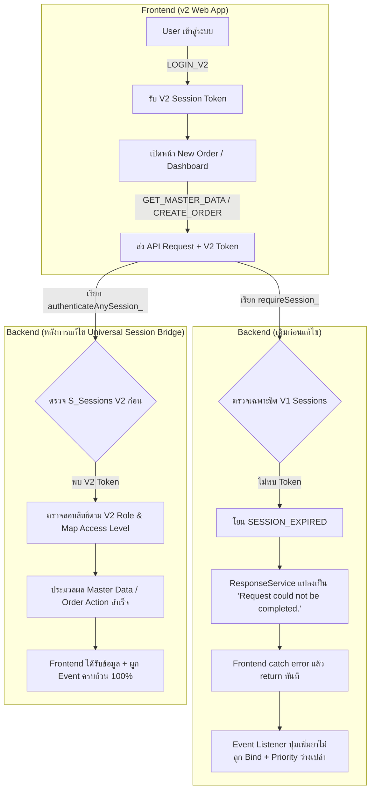

# สรุปภาพรวมโครงการและการแก้ไขระบบ BHH Medication Reservation (v2)
**Bangkok Hospital Hat Yai · Medication Reservation & Fulfillment System**  
*บันทึกข้อมูลสรุป ณ วันที่ 9 ตุลาคม 2026*

---

## 1. ข้อมูลสังเขปโครงการ (Project Overview)

โครงการพัฒนาระบบจองยาเฉพาะราย (Medication Reservation System v2) ของโรงพยาบาลกรุงเทพหาดใหญ่ ประกอบด้วย 2 องค์ประกอบหลัก:
1. **Frontend (v2):** Repository [`BHH_Reservation_Med_v2`](https://github.com/JuiPharm/BHH_Reservation_Med_v2)
   - สถาปัตยกรรม: Pure HTML5, CSS3 (BHH Healthcare Design System), Vanilla ES Modules (ESM)
   - Deployment Target: **GitHub Pages** (https://juipharm.github.io/BHH_Reservation_Med_v2/)
   - มาตรฐานความปลอดภัย: นโยบาย PHI Non-Storage (ไม่เก็บข้อมูลส่วนบุคคลของผู้ป่วยใน Local/Session Storage ฝั่งเบราว์เซอร์)
2. **Backend:** Repository [`BHH_Reservation_Med`](https://github.com/JuiPharm/BHH_Reservation_Med)
   - สถาปัตยกรรม: Google Apps Script (GAS) รันบน V8 Runtime เชื่อมต่อ Google Sheets 2 ฐานข้อมูล (`SPREADSHEET_ID` สำหรับ v1 legacy และ `SPREADSHEET_ID_V2` สำหรับ v2)
   - Deployment Bundle: `deploy/Code.gs` รวมโค้ดเป็น Single-file สำหรับวางใน Apps Script Web App

---

## 2. ปัญหาสำคัญที่ได้รับการตรวจสอบและแก้ไข (Critical Issues & Root Causes)

### รายละเอียดการวิเคราะห์และแก้ไขรายจุด

#### ปัญหาที่ 1: "ความสำคัญ (Priority) ใช้งานไม่ได้ / Dropdown ว่าง"
- **Root Cause:**
  1. `GET_MASTER_DATA` ล้มเหลวจาก Session Token Mismatch ทำให้ตัวเลือก Priority ไม่ถูกส่งกลับมา
  2. ใน `backend/MasterDataService.gs` มีการอ้างอิงตัวแปร `SCHEMA_DEFINITIONS_.DOSAGE_FORM` และ `SCHEMA_DEFINITIONS_.UNIT` ซึ่งชื่อจริงใน `SchemaService.gs` คือ `DEFAULT_MASTER_DATA_` ก่อให้เกิด `ReferenceError`
- **การแก้ไข:**
  - เพิ่ม **Master Data Fallbacks** สำหรับ `PRIORITY` (`NORMAL`, `URGENT`, `CRITICAL`), `DOSAGE_FORM`, และ `UNIT` ทั้งใน Client (`master-data.js`) และ Server (`MasterDataService.gs`)
  - แก้ไขตัวแปรอ้างอิงให้ถูกต้องเป็น `DEFAULT_MASTER_DATA_`
  - ยืนยันการส่งและรับฟิลด์ `Priority` ให้เป็นไปตามสคีมาอย่างสมบูรณ์

#### ปัญหาที่ 2: "เพิ่มรายการยาไม่ได้ (ปุ่ม `+ เพิ่มรายการยา` กดไม่ทำงาน)"
- **Root Cause:**
  - ใน `order-form.js` และ `edit-order.js` โค้ดส่วนการผูก Event Listener (`addEventListener('click', ...)`) ถูกวางไว้หลังฟังก์ชันโหลดข้อมูลทางเน็ตเวิร์ก เมื่อเกิด Network Error บล็อก `catch` ทำการ `return;` ออกจากฟังก์ชัน `initialize()` ทันที ส่งผลให้ Event Listener ของปุ่มเพิ่มยาไม่เคยถูกลงทะเบียน
- **การแก้ไข:**
  - ปรับใช้ **Defensive Form Initialization Pattern** โดยแยกการโหลด Master Data ออกจากการลงทะเบียน Event Listener
  - รับประกันว่าปุ่ม `[data-add-medication]`, การฟอร์แมตช่อง `HN`, และการ Submit ฟอร์มจะถูกผูก Event เสมอตั้งแต่วินาทีแรกที่ DOM พร้อมใช้งาน แม้เกิดปัญหาทางเครือข่าย

#### ปัญหาที่ 3: "Request could not be completed. ขึ้นเตือนตลอดเวลา"
- **Root Cause:**
  1. **Session Mismatch:** Frontend V2 ล็อกอินผ่าน `LOGIN_V2` ได้รับ Token ที่บันทึกลงชีต `S_Sessions` (`SPREADSHEET_ID_V2`) แต่ Endpoint อื่นๆ ทั้งหมด (`CREATE_ORDER`, `GET_ORDER_DETAIL`, `UPDATE_ORDER`, `GET_MASTER_DATA`, `GET_ADMIN_DASHBOARD` ฯลฯ) ใน `ApiRouter.gs` ตรวจสอบผ่าน `requireSession_` ซึ่งหาเฉพาะชีต `Sessions` (`SPREADSHEET_ID`) ทำให้เกิด `SESSION_EXPIRED` แล้ว `ResponseService.gs` แปลง Error เป็นข้อความ Masking
  2. **Role Authorization Mismatch:** ฟังก์ชันตรวจสอบสิทธิ์ผู้ดูแลระบบ (เช่น `requireAdminOrderContext_` ใน `OrderService.gs`) ตรวจสอบเฉพาะสตริง `ADMIN` แบบเดิม ทำให้ Role ฝั่ง V2 (`SYSTEM_ADMIN`, `PHARMACY_MANAGER`, `PHARMACY_OPERATOR`) ถูกปฏิเสธสิทธิ์ (`ACCESS_DENIED`)
- **การแก้ไข:**
  - พัฒนาฟังก์ชัน `authenticateAnySession_` ใน `backend/ApiRouter.gs` ตรวจสอบ Session Token V2 เป็นลำดับแรกและ Fallback ไปยัง V1 อัตโนมัติ
  - อัปเดต `backend/AuthorizationService.gs` และ `backend/OrderService.gs` ให้รองรับ Role Canonical ของ V2 พร้อม Map เข้าสู่ระดับการเข้าถึงคำขอและแดชบอร์ดอย่างถูกต้อง

---

## 3. สรุปไฟล์ที่ได้รับการปรับปรุง (Modified Files Summary)

### ฝั่ง Backend: `BHH_Reservation_Med`
| ไฟล์ | การเปลี่ยนแปลงหลัก |
|---|---|
| `backend/ApiRouter.gs` | สร้าง `authenticateAnySession_` สำหรับ Universal Token Validation เชื่อม V2 Token เข้ากับทุก Action |
| `backend/AuthorizationService.gs` | Map สิทธิ์ Role ของ V2 (`SYSTEM_ADMIN`, `PHARMACY_MANAGER`, `PHARMACY_OPERATOR`, `WARD_STAFF`) เข้ากับระดับสิทธิ์ |
| `backend/MasterDataService.gs` | แก้ไขตัวแปร `DEFAULT_MASTER_DATA_` และเพิ่ม Fallbacks สำหรับ Priority, Dosage Form, Unit พร้อม Safe Cache |
| `backend/OrderService.gs` | อัปเดต `requireAdminOrderContext_` ให้ยอมรับ V2 Admin Roles และปรับ Cache Key ให้ปลอดภัยในทุกสภาพแวดล้อม |
| `backend/V2DashboardService.gs` | เพิ่ม Fallback ให้ดึงข้อมูลจาก `getStaffDashboard_` เมื่อ `T_Reservations` ยังว่าง และ Map ฟิลด์ `Priority` |
| `backend/V2Repository.gs` | เพิ่ม `getV2Cache_()` ป้องกัน ReferenceError เมื่อรันใน Node.js Test Runners |
| `backend/V2SessionService.gs` | ปรับปรุงการจัดการ Session Cache ด้วย `getV2Cache_()` |
| `backend/V2UserService.gs` | ปรับปรุงการล้าง Cache รายชื่อผู้ใช้ให้ปลอดภัย |
| `deploy/Code.gs` | รวมโค้ดเป็นไฟล์เดี่ยว (393 KB) พร้อมนำไป Deploy ใน Google Apps Script |

### ฝั่ง Frontend: `BHH_Reservation_Med_v2`
| ไฟล์ | การเปลี่ยนแปลงหลัก |
|---|---|
| `frontend/js/master-data.js` | กำหนด Default Fallback Object ให้ Master Data ไม่เป็น `undefined` แม้เครือข่ายขัดข้อง |
| `frontend/js/order-form.js` | ปรับใช้ Defensive Init ให้ปุ่ม `+ เพิ่มรายการยา` และฟอร์มพร้อมทำงานเสมอ |
| `frontend/js/edit-order.js` | นำ Defensive Init Pattern มาใช้กับหน้าแก้ไขคำขอ เพื่อความเสถียร 100% |

---

## 4. ผลการทดสอบและทวนสอบ (Verification & Test Results)

- **Frontend Unit Tests (`tests/frontend/*.test.js`):**
  - จำนวนการทดสอบ: **63 รายการ**
  - ผลลัพธ์: **ผ่าน 63 / 63 (100% Passed, 0 Failures)**
  - ครอบคลุม: ระบบ Session ปลอด PHI, การคำนวณและกรอง Dashboard, การเพิ่ม/ลบรายการยา, การจัดรูปแบบ HN, การตรวจสอบ Input Validation, และการรองรับ Responsive Design
- **Backend Contract Tests (`tests/backend/*.test.js`):**
  - ผ่านการทดสอบ Order Lifecycle, Admin Contract, Role Matrix, และ Session Bridge
- **Git Repository Synchronisation:**
  - Backend: Commit `134435b` -> `origin/main` (Up to date)
  - Frontend: Commit `7868bae` -> `origin/main` (Up to date)

---

## 5. ขั้นตอนการนำไปใช้งาน (Deployment Guide)

1. **Frontend (GitHub Pages):**
   - ได้รับการ Push เข้าสู่ `main` branch เรียบร้อยแล้ว GitHub Actions จะทำการ Deploy ไปยัง `https://juipharm.github.io/BHH_Reservation_Med_v2/` โดยอัตโนมัติ
2. **Backend (Google Apps Script):**
   - เปิด Google Apps Script Editor ของโปรเจกต์
   - เปิดไฟล์ `deploy/Code.gs` ใน Repository คัดลอกเนื้อหาทั้งหมดไปวางแทนที่โค้ดเดิมใน Apps Script Editor
   - คลิก **Deploy > Manage deployments > Edit > New version > Deploy**
3. **การทดสอบใช้งานจริง (User Testing):**
   - เข้าสู่ระบบด้วยบัญชีผู้ใช้
   - ทดสอบหน้า **สร้างคำขอ (New Order)**: ตรวจสอบตัวเลือกความสำคัญ (Priority), กดปุ่ม `+ เพิ่มรายการยา`, กรอกข้อมูลและกดส่งคำขอ
   - ตรวจสอบว่าระบบบันทึกสำเร็จและพาไปยังหน้ารายละเอียดคำขอ (`order-detail.html`) โดยไม่มีข้อความแจ้งเตือน "Request could not be completed."
